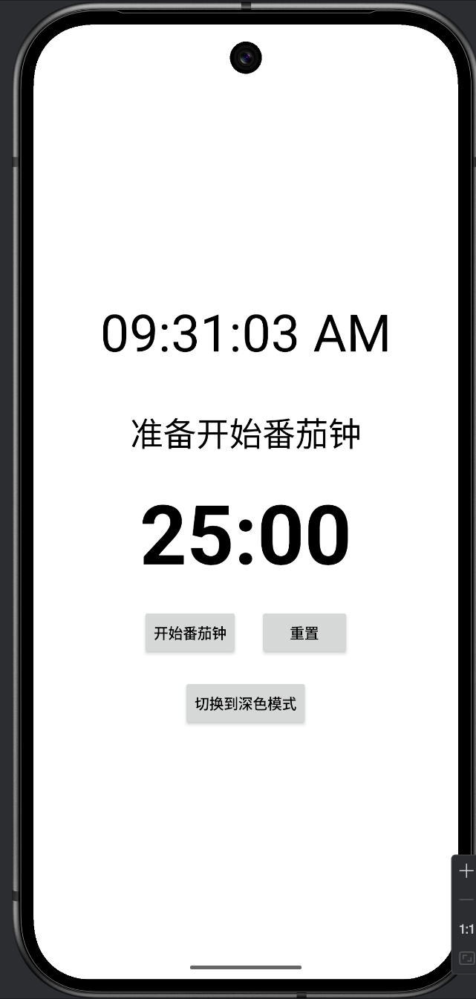
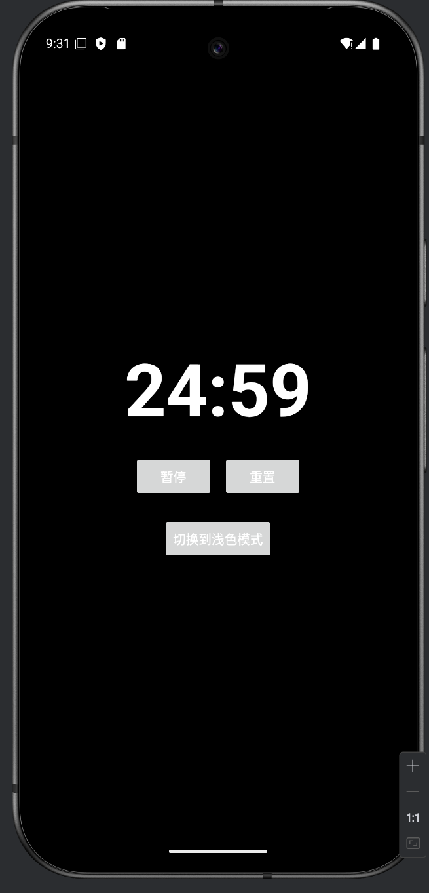

#  TextClock
数字时钟显示，含专注模式和番茄计时功能。

功能：
- 浅色模式和深色模式时间显示
- 番茄时钟计时。25分钟番茄计时，专注模式(深色模式)；5分钟休息计时，休闲模式(浅色模式)。

# TODO
- [ ] 添加计时结束响铃功能，或者震动
- [ ] 添加设置功能，可以自由设置番茄时间和休息时间
- [ ] 添加计数功能，显示总番茄次数和当日番茄次数，可统计每日番茄次数并绘出番茄曲线图
- [x] 设置apk图标
- [x] 添加屏幕常亮